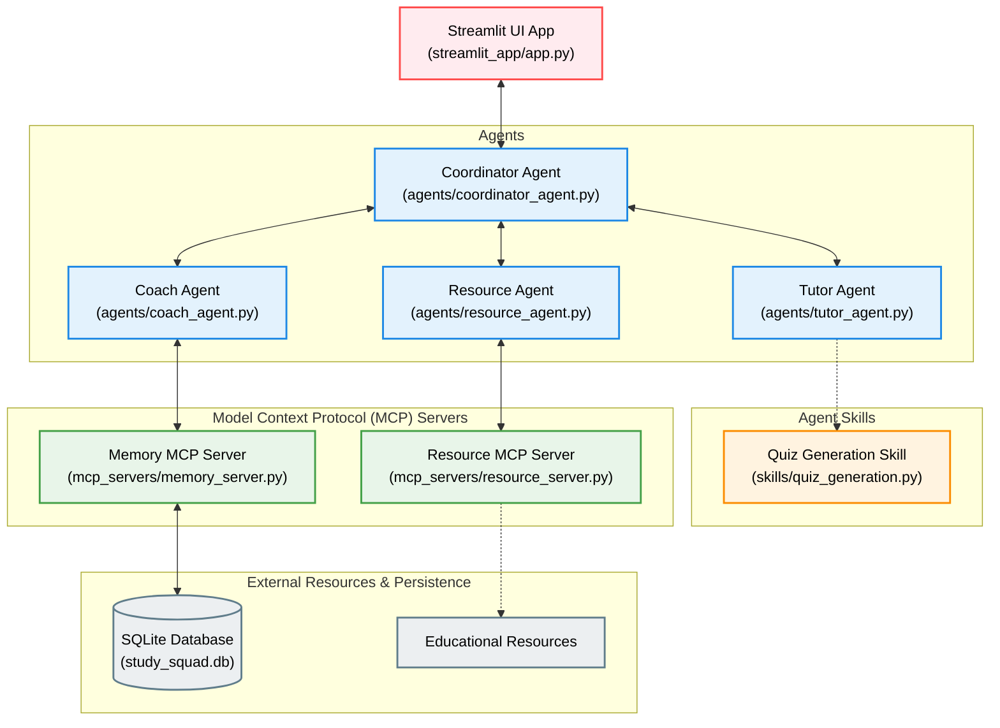

# Study Squad AI

YouTube Demo: https://www.youtube.com/watch?v=kGuBN9sbu0M

Study Squad AI is an AI-powered educational assistant that helps students learn through personalized assessments, progress tracking, motivational coaching, and curated learning resources. Rather than acting as a general-purpose chatbot, Study Squad AI coordinates multiple specialized AI agents that work together to generate quizzes, evaluate student performance, identify learning gaps, recommend educational resources, and monitor progress across study sessions. The application was developed for Kaggle's **AI Agents: Intensive Vibe Coding Capstone** under the **Agents for Good** track.

The project demonstrates modern agentic AI concepts that include:

- Google Agent Development Kit (ADK),
- Multi-agent orchestration,
- Model Context Protocol (MCP),
- Reusable Agent Skills, and
- Cloud deployment using Google Cloud Run.

## Repository Structure

- agents/ - Specialized AI agents
- adk_app/ - Google ADK demonstration
- mcp_servers/ - MCP Servers and tool integrations
- skills/ - Reusable agent skills
- streamlit_app/ - User interface and application entry point
- tests/ - Test suite
- database.py - SQLite utilities
- grading.py - Quiz grading logic 
- Dockerfile
- requirements.txt

## Features

- Personalized quiz generation
- Multi-agent orchestration
- Persistent learning history
- AI-generated coaching feedback
- Curated educational resources
- Interactive Streamlit interface
- Containerized deployment
- Google Cloud Run deployment

## System Architecture

The following diagram summarizes how the major components of Study Squad AI interact during a learning session.



### Key Components

* **Streamlit UI App**: The entry-point user interface where the student selects topics, runs learning sessions, takes quizzes, and views grades and recommendations.
* **Coordinator Agent**: The central controller that manages the workflow, invokes the Tutor, Coach, and Resource agents, and aggregates their inputs.
* **Tutor Agent & Quiz Skill**: The Tutor Agent requests a quiz by executing the reusable **Quiz Generation Skill** powered by Gemini.
* **Coach Agent & Memory MCP Server**: The Coach Agent analyzes quiz scores and leverages the **Memory MCP Server** to query performance logs and identify weak topics saved in the local **SQLite Database**.
* **Resource Agent & Resource MCP Server**: The Resource Agent queries the **Resource MCP Server** to retrieve curated educational resources based on the student's selected topic and difficulty level.


## Technology Stack

**AI**

- Google Gemini
- Google ADK

**Agent Technologies**

- Multi-Agent Architecture
- Model Context Protocol (MCP)

**Frontend**

- Streamlit

**Backend**

- Python
- SQLite

**Deployment**

- Docker
- Google Cloud Run

## Current Scope

The initial version of Study Squad AI focuses on:

- Three specialized AI agents (Tutor, Coach, Resource)
- One reusable Quiz Generation Skill
- Two MCP servers (Resource and Memory)
- Streamlit user interface
- Google Cloud Run deployment

Features such as calendar integration, adaptive learning, advanced analytics, and additional resource providers are considered future enhancements and are intentionally outside the scope of the initial release.

---

# Getting Started

## Clone the Repository

```bash
git clone <repository-url>
cd study-squad-ai
```

---

## Create a Virtual Environment

Windows

```bash
python -m venv venv

venv\Scripts\activate
```

macOS / Linux

```bash
python -m venv venv

source venv/bin/activate
```

---

## Install Dependencies

```bash
pip install -r requirements.txt
```

---

## Configure Environment Variables

Create a `.env` file in the project root. Use the `.env.example` file available in this repository which is the template for the `.env` file. Copy `.env.example` to `.env` and replace the placeholder values with your own Gemini API key.

Example:

```env
GEMINI_API_KEY=your_api_key
```

---

## Run the Application

These commands assume that Docker is installed and that you have already authenticated with Google Cloud using the Google Cloud CLI.

```bash
streamlit run streamlit_app/app.py
```

Open

```
http://localhost:8501
```

---

# Running with Docker

Build the Docker image.

```bash
docker build -t study-squad-ai .
```

Run the container.

```bash
docker run -p 8501:8080 --env-file .env study-squad-ai
```

Open

```
http://localhost:8501
```

---

# Deploying to Google Cloud Run

## Prerequisites

- Google Cloud CLI
- Docker
- Google Cloud Project
- Billing Enabled
- Gemini API Key

Authenticate with Google Cloud.

```bash
gcloud auth login
```

Set your project.

```bash
gcloud config set project <PROJECT_ID>
```

Enable the required services.

```bash
gcloud services enable cloudbuild.googleapis.com run.googleapis.com
```

Build the Docker image.

```bash
gcloud builds submit --tag gcr.io/<PROJECT_ID>/study-squad-ai
```

Deploy to Cloud Run.

```bash
gcloud run deploy study-squad-ai \
    --image gcr.io/<PROJECT_ID>/study-squad-ai \
    --platform managed \
    --allow-unauthenticated \
    --region us-central1 \
    --set-env-vars GEMINI_API_KEY=your_api_key
```

---

# Testing

The repository includes component and integration tests for the major modules:

```bash
python -m tests.test_quiz_generation

python -m tests.test_tutor_agent

python -m tests.test_resource_agent

python -m tests.test_memory_server

python -m tests.test_coordinator_agent
```

These tests verify quiz generation, grading, resource recommendation, memory persistence, and end-to-end agent coordination.

---

# Google ADK Demonstration

The repository also contains a lightweight Google ADK implementation demonstrating how the reusable Quiz Generation Skill can be exposed as an ADK `FunctionTool`.

This complements the production multi-agent architecture while showcasing concepts covered throughout Google's AI Agents course.

---

# Future Work

Potential future enhancements include:

- Cloud SQL for scalable data persistence
- User authentication
- Additional academic subjects
- Adaptive learning paths
- Richer learning analytics
- Expanded educational resource providers

---

# License

This project is licensed under the MIT License.
