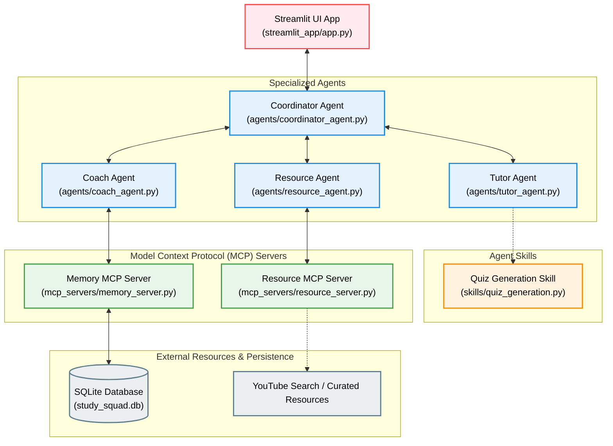

# Study Squad AI

Study Squad AI is a multi-agent educational assistant designed to help students prepare for exams and strengthen their understanding of academic topics. Unlike traditional AI chatbots, Study Squad AI uses a team of specialized agents that collaborate to assess knowledge, identify weaknesses, recommend learning resources, and generate personalized learning plans. 

The project demonstrates modern agentic AI concepts that include:

- Google Agent Development Kit (ADK),
- Multi-agent orchestration,
- Model Context Protocol (MCP),
- Reusable Agent Skills, and
- Cloud deployment using Google Cloud Run.

## Repository Structure

agents/ - Specialized AI agents

mcp/ - MCP Servers and tool integrations

skills/ - Reusable agent skills

streamlit_app/ - User interface and application entry point

## Project Goals

The objectives for this project include:

- Building a multi-agent learning assistant using Google ADK,
- Implementing MCP Servers that provide external tools and memory,
- Developing reusable Agent Skills for educational workflows,
- Deploying the application publicly using Google Cloud Run, and
- Creating a competition-ready demonstration showing agent collaboration.

## System Architecture



### Key Components

* **Streamlit UI App**: The entry-point user interface where the student selects topics, runs learning sessions, takes quizzes, and views grades and recommendations.
* **Coordinator Agent**: The central controller that manages the workflow, invokes the Tutor, Coach, and Resource agents, and aggregates their inputs.
* **Tutor Agent & Quiz Skill**: The Tutor Agent requests a quiz by executing the reusable **Quiz Generation Skill** powered by Gemini.
* **Coach Agent & Memory MCP Server**: The Coach Agent analyzes quiz scores and leverages the **Memory MCP Server** to query performance logs and identify weak topics saved in the local **SQLite Database**.
* **Resource Agent & Resource MCP Server**: The Resource Agent queries the **Resource MCP Server** to find appropriate videos (using YouTube search or local listings) based on the student's needs.


## Technology Stack

- Python
- Google ADK
- MCP
- Gemini
- Streamlit
- SQLite
- Google Cloud Run

## Current Scope

The initial version of Study Squad AI focuses on:

- Three specialized agents (Tutor, Coach, Resource)
- One reusable Quiz Generation Skill
- Two MCP servers (Resource and Memory)
- Streamlit user interface
- Google Cloud Run deployment

Features such as calendar integration, adaptive learning, advanced analytics, and additional resource providers are considered future enhancements and are intentionally outside the scope of the initial release.

## Getting Started

### Prerequisites

- Python 3.10+
- A Gemini API Key (get one from [Google AI Studio](https://aistudio.google.com/))
- A YouTube API Key (optional, for the Resource MCP server)

---

### Method 1: Running Locally with Python

1. **Clone the repository**:
   ```bash
   git clone <repository-url>
   cd study-squad-ai
   ```

2. **Set up a virtual environment**:
   ```bash
   python -m venv venv
   # On Windows:
   venv\Scripts\activate
   # On macOS/Linux:
   source venv/bin/activate
   ```

3. **Install dependencies**:
   ```bash
   pip install -r requirements.txt
   ```

4. **Configure environment variables**:
   Create a `.env` file in the root directory (you can copy `.env.example` as a template):
   ```env
   GEMINI_API_KEY=your_gemini_api_key
   YOUTUBE_API_KEY=your_youtube_api_key
   ```
   *(Ensure there are no quotation marks around the API keys).*

5. **Run the Streamlit application**:
   ```bash
   streamlit run streamlit_app/app.py
   ```
   Open your browser and navigate to `http://localhost:8501`.

---

### Method 2: Running with Docker

Alternatively, you can build and run the application inside the Docker container you created:

1. **Build the Docker image**:
   ```bash
   docker build -t study-squad-ai .
   ```

2. **Run the Docker container**:
   ```bash
   docker run -p 8501:8080 --env-file .env study-squad-ai
   ```
   Open your browser and navigate to `http://localhost:8501`.

---

## Deployment to Google Cloud Run

Follow these steps to build your container image in the cloud and deploy it to Google Cloud Run using the Google Cloud SDK (`gcloud`) in Windows PowerShell or Command Prompt.

### Step 1: Install and Initialize Google Cloud SDK
Ensure you have the Google Cloud SDK installed. If not, download it from [Google Cloud CLI documentation](https://cloud.google.com/sdk/docs/install).

Once installed, authenticate and connect to your Google Cloud account:
```powershell
gcloud auth login
```

### Step 2: Set Your Active Google Cloud Project
Ensure your local `gcloud` configuration points to your active project ID. This is critical because `gcloud builds` executes within the context of your active project:
```powershell
gcloud config set project <PROJECT_ID>
```
*(Replace `<PROJECT_ID>` with your project ID, e.g., `primal-monument-455918-h0`).*

### Step 3: Enable Required APIs
Ensure the Cloud Build and Cloud Run APIs are enabled for your project:
```powershell
gcloud services enable cloudbuild.googleapis.com run.googleapis.com
```

### Step 4: Build and Push the Container Image (Google Cloud Build)
Submit your local code to Google Cloud Build, which will read the `Dockerfile`, compile the image, and host it in Google Container Registry (or Artifact Registry):
```powershell
gcloud builds submit --tag gcr.io/<PROJECT_ID>/study-squad-ai
```

### Step 5: Deploy the Container to Google Cloud Run
Deploy the newly built container image. In this command:
- We pass the Gemini API key securely to the runtime environment using `--set-env-vars`.
- Ensure you do not surround keys in quotation marks.
- (Optional) If you have a YouTube API key, append it to the list of environment variables.

```powershell
gcloud run deploy study-squad-ai `
  --image gcr.io/<PROJECT_ID>/study-squad-ai `
  --platform managed `
  --allow-unauthenticated `
  --region us-central1 `
  --set-env-vars GEMINI_API_KEY=your_gemini_api_key
```

*Note: In Windows CMD, replace the backticks (`` ` ``) with carets (`^`) for multi-line commands, or write it all as a single line.*


